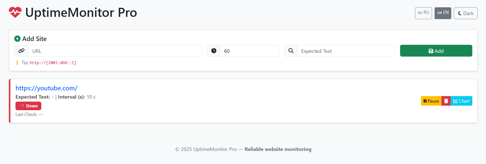
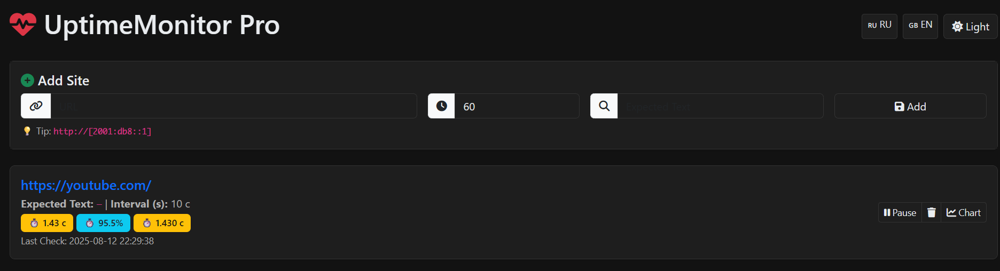

<p align="center">
  
</p>

<h1 align="center">🚀 UptimeMonitor Pro</h1>
<p align="center">
  <em>Real-time website monitoring with instant Telegram alerts</em>
</p>

<a id="uptimemonitor-pro-en"></a>

[Русская версия →](#uptimemonitor-pro-ru)

A powerful, real-time website monitoring system with Telegram alerts, dark mode, and multi-language support.


🌍 **Languages:** RU / EN  
🔔 **Telegram alerts on downtime**  
📊 **Live charts & admin stats**  
🌙 **Dark/Light mode (saved)**  
🌐 **Works in restricted regions (Mobile-ready)**

---

## 📸 Screenshots

### Dashboard (Light)


### Dashboard (Dark)


---

## 🔧 Features

- ✅ Real-time updates via SSE
- ✅ Telegram notifications on site failure
- ✅ SSL certificate expiry warnings
- ✅ Multi-language (Russian / English)
- ✅ Dark & Light theme (persists)
- ✅ Admin panel with uptime charts
- ✅ Auto-detect browser language
- ✅ IPv6 & HTTPS support

---

## 📦 Setup

```bash
# 1. Clone the repo
git clone https://github.com/vazor-code/UptimeMonitor.git
cd UptimeMonitor

# 2. Create virtual environment
python -m venv venv

# For Windows:
venv\Scripts\activate

# For Linux/Mac:
source venv/bin/activate

# 3. Install dependencies
pip install -r requirements.txt

# 4. Create .env file
# For Windows:
copy .env.example .env

# For Linux/Mac:
# cp .env.example .env

# 5. Edit .env
# Open .env in Notepad or any editor
TELEGRAM_TOKEN=your_token
TELEGRAM_CHAT_ID=your_chat_id

# How to get chat_id:
# 1. Start bot @BotFather and get token
# 2. Start your bot
# 3. Open: https://api.telegram.org/bot<TOKEN>/getUpdates
# 4. Send a message to your bot
# 5. Refresh the page — find "chat" → "id"

# 6. Run the app
python app.py
🌐 Open: http://localhost:5000
```

## 📬 Feedback
Found a bug? Want a feature?
Open an issue or contact me: scoutboy0202@gmail.com

---
<p align="center">
  
</p>

<h1 align="center">🚀 UptimeMonitor Pro</h1>
<p align="center">
  <em>Мониторинг сайтов в реальном времени с мгновенными Telegram-оповещениями</em>
</p>

<a id="uptimemonitor-pro-ru"></a>

[English version →](#uptimemonitor-pro-en)

Мощная система мониторинга сайтов в реальном времени с Telegram-оповещениями, темной темой и поддержкой нескольких языков.


🌍 **Языки:** RU / EN  
🔔 **Telegram-оповещения при падении**  
📊 **Графики и статистика в админке**  
🌙 **Темная/Светлая тема (сохраняется)**  
🌐 **Работает в ограниченных регионах (Mobile-ready)**

---

## 📸 Скриншоты

### Дашборд (Светлая тема)


### Дашборд (Темная тема)


---

## 🔧 Возможности

- ✅ Обновления в реальном времени (SSE)
- ✅ Уведомления в Telegram при проблемах
- ✅ Контроль срока SSL-сертификатов
- ✅ Двуязычный интерфейс (Русский/Английский)
- ✅ Темная и светлая темы (сохраняются)
- ✅ Админка с графиками uptime
- ✅ Автоопределение языка браузера
- ✅ Поддержка IPv6 и HTTPS

## 🤯 Почему все качают это?
- **Бесплатно** то, за что другие берут $10/месяц
- Настройка за **5 минут** (в 3 раза быстрее аналогов)
- Первый **русскоязычный** мониторинг с Telegram-ботом

---

## 📦 Установка

```bash
# 1. Клонируем репозиторий
git clone https://github.com/vazor-code/UptimeMonitor.git
cd UptimeMonitor

# 2. Создаем виртуальное окружение
python -m venv venv

# Для Windows:
venv\Scripts\activate

# Для Linux/MacOS:
source venv/bin/activate

# 3. Устанавливаем зависимости
pip install -r requirements.txt

# 4. Создаем .env файл
# Для Windows:
copy .env.example .env

# Для Linux/MacOS:
# cp .env.example .env

# 5. Редактируем .env
# Открываем .env в любом редакторе
TELEGRAM_TOKEN=ваш_токен
TELEGRAM_CHAT_ID=ваш_chat_id

# Как получить chat_id:
# 1. Создайте бота через @BotFather и получите токен
# 2. Запустите своего бота
# 3. Откройте: https://api.telegram.org/bot<TOKEN>/getUpdates
# 4. Отправьте сообщение боту
# 5. Обновите страницу — найдите "chat" → "id"

# 6. Запускаем приложение
python app.py
🌐 Открываем: http://localhost:5000
```

## 📬 Обратная связь
Нашли баг? Хотите новую функцию?
Создайте issue или напишите мне: scoutboy0202@gmail.com

## 🎉 Автор
Сделано с ❤️ от vazor
2025 · MIT License
